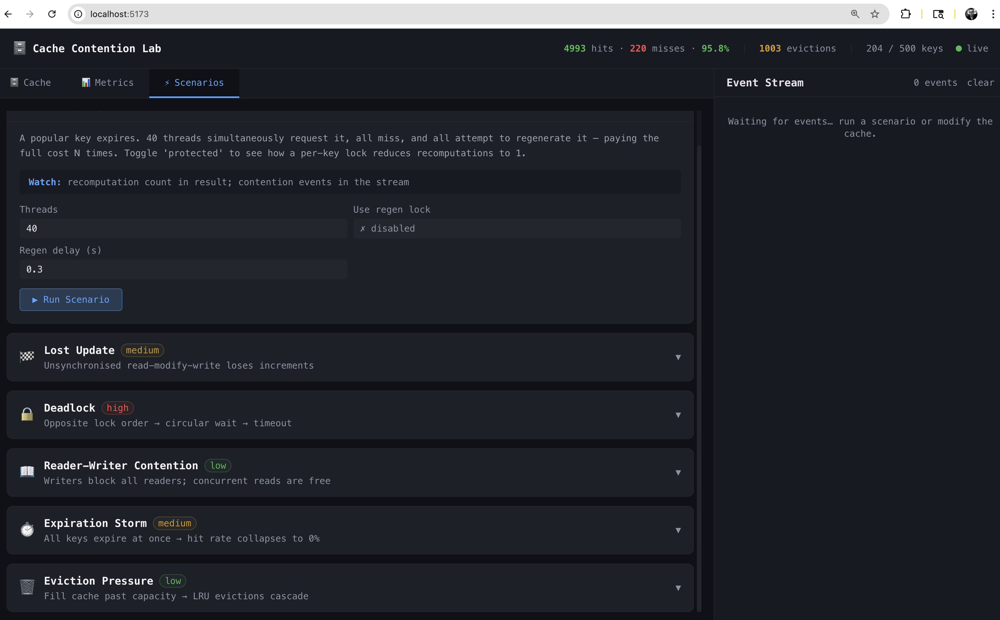
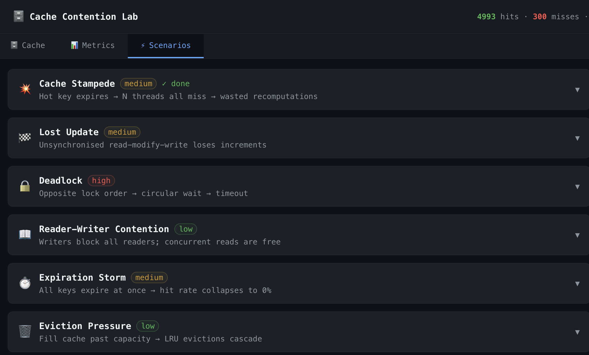
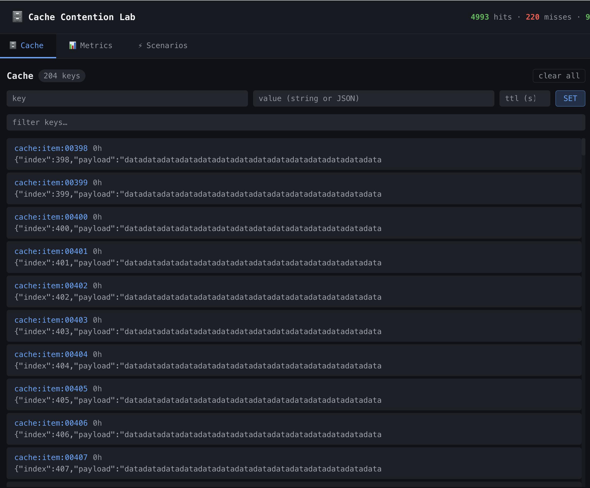
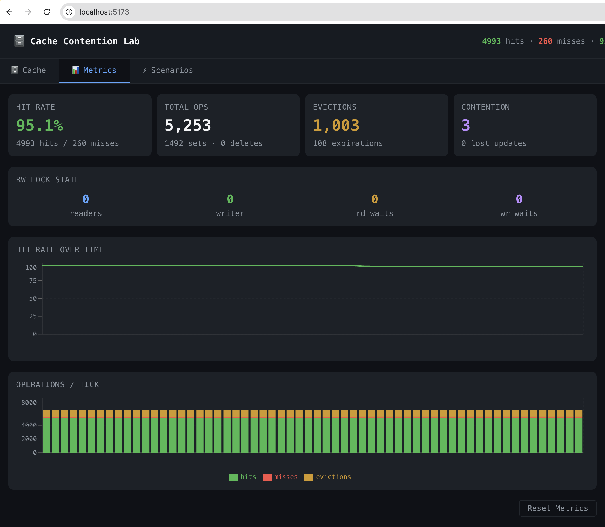
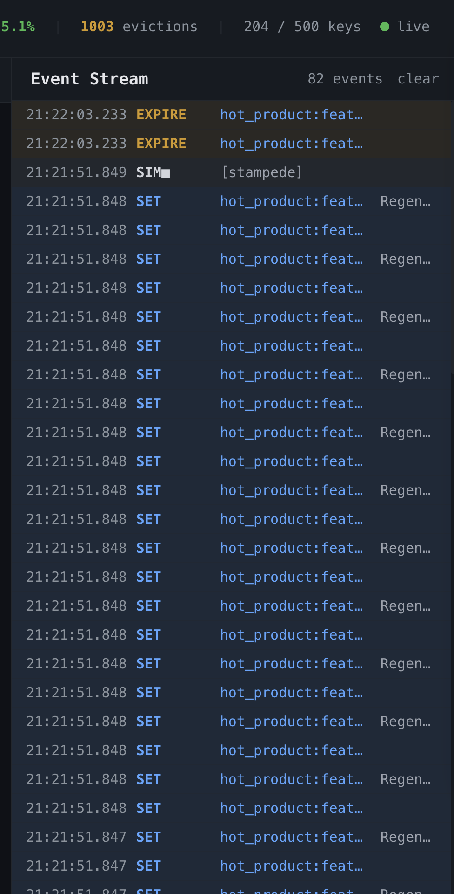
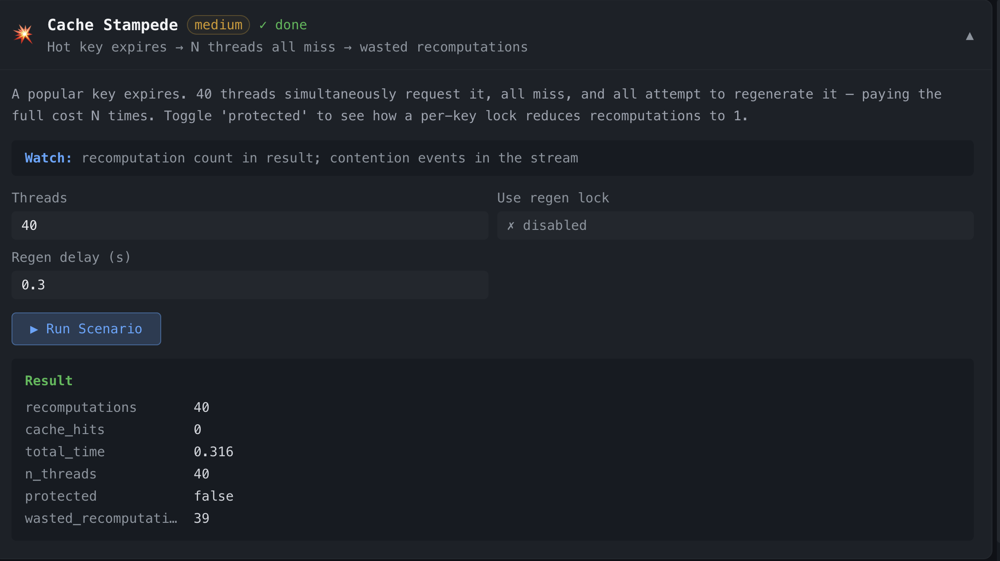

# Cache Contention Lab

A thread-safe in-memory cache built from scratch in Python, with a React UI that demonstrates real concurrency failure modes live in your browser.

> **What makes this different from a tutorial:** every scenario you trigger actually runs real OS threads competing for real locks. The hit rate collapses, lost updates show up in the numbers, and deadlocks visibly time out — all in real time.



---

## Table of Contents

1. [Quick Start](#quick-start)
2. [UI Tour](#ui-tour)
3. [User Guide](#user-guide)
   - [Scenarios tab](#scenarios-tab)
   - [Cache tab](#cache-tab)
   - [Metrics tab](#metrics-tab)
   - [Event Stream](#event-stream)
4. [Scenario Walkthroughs](#scenario-walkthroughs)
5. [API Reference](#api-reference)
6. [Backend Dependency Management](#backend-dependency-management-poetry)
7. [Architecture Notes](#architecture-notes)

---

## Quick Start

**Prerequisites:** Python 3.12+, [Poetry](https://python-poetry.org/docs/#installation), Node 20+, npm.

```bash
# Terminal 1 — backend
cd backend
poetry install
make dev          # FastAPI + uvicorn on :8000, live reload

# Terminal 2 — frontend
cd frontend
npm install
npm run dev       # Vite on :5173, proxies /api and /ws to :8000
```

Open **http://localhost:5173**

Or with Docker:

```bash
docker compose up --build   # backend :8000, frontend :5173
```

---

## UI Tour

The interface is split into three areas:

```
┌─────────────────────────────────────────────────────────────────┐
│  🗄️ Cache Contention Lab    [hits · misses · hit%] [● live]    │  ← top bar
├──────────────────────────────────────┬──────────────────────────┤
│  🗄️ Cache  📊 Metrics  ⚡ Scenarios  │                          │
│  ─────────────────────────────────── │   Event Stream           │
│                                      │                          │
│   [ main panel — tab content ]       │   newest events at top   │
│                                      │   color-coded by type    │
│                                      │                          │
└──────────────────────────────────────┴──────────────────────────┘
```

- **Top bar** — live hit rate, eviction count, and key count update every second. The green/red dot shows WebSocket connection status.
- **Left panel** — three tabs: Scenarios, Cache, Metrics.
- **Right panel** — real-time event stream, always visible regardless of active tab.

---

## User Guide

### Scenarios tab



This is the starting point. Six scenario cards are listed, each collapsed by default. Click any card header to expand it.

**Anatomy of a scenario card:**

```
💥 Cache Stampede                          [medium] [● running]
   Hot key expires → N threads all miss → wasted recomputations      ▲
 ─────────────────────────────────────────────────────────────────────
  Description of what happens and why it matters.

  Watch: recomputation count in result; contention events in stream

  Threads      [ 40  ]    Use regen lock  [ ✗ disabled ]
  Regen delay  [ 0.3 ]

  [ ▶ Run Scenario ]

  ── Progress ────────────────────────────────────
  Hot key set, expires in 0.5s                 10%
  ████░░░░░░░░░░░░░░░░░░░░░░░░░░░░░░░░░░░░░░░░

  ── Result ──────────────────────────────────────
  recomputations        40
  cache_hits            0
  wasted_recomputations 39
  total_time            12.3
  protected             false
```

**While a scenario is running:**
- A blue progress bar and status message appear below the header, visible even when the card is collapsed.
- Parameters are disabled (greyed out) — you cannot change them mid-run.
- The `● running` badge pulses in the header.
- The **Stop** button replaces **Run Scenario**.

**After a scenario completes:**
- A `✓ done` badge appears in the header.
- The Result panel shows every key-value pair returned by the simulation.
- The progress bar shows 100% / "Completed".

---

### Cache tab



Browse and directly manipulate the live cache state.

**Adding an entry manually:**

| Field | What to put |
|---|---|
| key | Any string, e.g. `user:42` |
| value | A string, or valid JSON — e.g. `{"name":"alice"}` |
| ttl (s) | Optional. Leave blank for no expiry. `10` = expires in 10 seconds. |

Click **SET** to write the entry. It appears in the list immediately.

**Reading the entry list:**

Each row shows:
- **Key** (blue) — the cache key
- **Hit count** — how many times this entry has been read since it was written
- **TTL bar** — a colour-coded bar showing how much TTL remains (green → yellow → red as it drains)
- **TTL seconds** — remaining seconds, updating every second
- Hover any row to reveal the **✕** delete button

**Filter:** Type in the filter box to narrow the list by key substring. Useful during Eviction Pressure when 600 keys are written.

**Clear all:** Removes every key instantly — useful to reset state between scenario runs.

---

### Metrics tab



Four stat cards update every second:

| Card | What to watch |
|---|---|
| **Hit Rate** | Should be high (green) at rest. Collapses during Expiration Storm. |
| **Total Ops** | Counts cumulative gets + misses + sets + deletes. Spikes during scenarios. |
| **Evictions** | Increments during Eviction Pressure. Zero at rest with a small cache. |
| **Contention** | Increments on lock waits and detected races. Spikes during Stampede and Deadlock. |

**RW Lock State panel** (appears below stat cards):

| Field | Meaning |
|---|---|
| readers | Active concurrent readers right now |
| writer | 1 if a writer holds the lock, 0 otherwise |
| rd waits | Total times a reader had to wait for a writer |
| wr waits | Total times a writer had to wait for readers |

During **Reader-Writer Contention**, watch `readers` spike to 30 simultaneously while `writer` stays 0. When a writer fires, `readers` drops to 0 and `writer` = 1.

**Hit Rate Over Time chart** — 60-second rolling line chart. The cliff during Expiration Storm is immediately visible here.

**Operations / Tick chart** — stacked bar chart of hits (green), misses (red), evictions (orange) per 2-second tick. High misses → low hit rate.

**Reset Metrics** — zeroes all counters and clears history. Run this between scenarios for clean before/after comparisons.

---

### Event Stream



The right-hand panel shows every cache event as it happens. Newest events appear at the top.

**Event colour coding:**

| Colour | Events |
|---|---|
| 🟢 Green | `HIT` — cache read returned a value |
| 🔴 Red | `MISS` — cache read found nothing (key absent or expired) |
| 🔵 Blue | `SET` — a value was written |
| ⚫ Grey | `DEL`, `SIM■` — deletion or scenario end |
| 🟠 Orange | `EVICT`, `EXPIRE` — LRU eviction or TTL expiry |
| 🟣 Purple | `CONTEND` — a thread waited for a lock |
| 🔴 Red | `RACE` — a lost update was recorded |
| 🔵 Blue | `SIM▶` — scenario started |

**Tips:**
- During Cache Stampede, watch for a burst of `MISS` events followed by many `SET` events (all threads writing the regenerated value simultaneously in unprotected mode).
- During Deadlock, look for `CONTEND` events with "TIMED OUT" in the message.
- Click **clear** to empty the log before starting a scenario for a clean read.

---

## Scenario Walkthroughs

### 💥 Cache Stampede

**Goal:** See how many threads wastefully repeat an expensive operation when a hot cache key expires simultaneously for all of them.

**Steps:**
1. Open the **Cache Stampede** card.
2. Set **Threads** = 40, **Use regen lock** = disabled, **Regen delay** = 0.3s.
3. Click **▶ Run Scenario**. Watch the Event Stream flood with `MISS` then `SET` events.
4. Check the Result — `recomputations` should equal `n_threads` (40 wasted calls).
5. Click **Reset Metrics**, then re-run with **Use regen lock** = enabled.
6. Now `recomputations` = 1; the rest are cache hits.

**What changed:** the per-key regeneration lock means only the first thread to acquire it does the work. All others wait, then get the already-written value on their next `GET`.



---

### 🏁 Lost Update

**Goal:** Observe how unsynchronised read-modify-write causes increments to disappear.

**Steps:**
1. Open **Lost Update**. Set **Threads** = 50, **Use per-key lock** = disabled.
2. Run. In the Result, note `actual` is significantly below `expected` (50). The gap is `lost_updates`.
3. Reset Metrics. Re-run with **Use per-key lock** = enabled.
4. Now `actual` = `expected` = 50. No updates lost.

**What changed:** the per-key `RLock` makes the read-modify-write atomic. Thread 2 cannot read the counter until Thread 1 has finished writing its incremented value.

---

### 🔒 Deadlock

**Goal:** Watch two threads mutually block, then time out.

**Steps:**
1. Open **Deadlock**. Leave **Lock timeout** = 3s.
2. Run. Within a few seconds, two `CONTEND` events appear with "TIMED OUT" in the message.
3. Check the Result: one of `thread_a` / `thread_b` shows `timed_out`, and `deadlock_detected` = true.
4. Increase timeout to 10s and re-run — both threads wait longer before giving up.

**The fix (not shown in the simulation):** always acquire locks in a consistent, globally-agreed order — e.g. alphabetical by key name. If both threads always lock `alpha` before `beta`, the circular dependency cannot form.

---

### 📖 Reader-Writer Contention

**Goal:** See concurrent reads coexist, and observe a writer stalling all of them.

**Steps:**
1. Switch to the **Metrics** tab first so the RW Lock State panel is visible.
2. Switch back to **Scenarios**, open **Reader-Writer Contention**, set Readers = 30, Writers = 3, Duration = 8s.
3. Run. Switch quickly to **Metrics**.
4. Watch `readers` oscillate between 0 and 30. When a writer fires, `readers` drops to 0 and `writer` = 1. As soon as the write finishes, readers flood back in.

---

### ⏱️ Expiration Storm

**Goal:** See the hit rate cliff when all keys expire at the same moment.

**Steps:**
1. Go to **Metrics** tab and click **Reset Metrics**.
2. Open **Expiration Storm**. Set Keys = 100, TTL = 5s.
3. Run. The hit rate chart will show ~100% for 5 seconds, then a sudden vertical drop to 0%.
4. The Event Stream will show a burst of `EXPIRE` events all timestamped within the same second.

**The fix:** use `ttl + random.uniform(0, ttl * 0.2)` to spread expiry across a 20% window — a one-line change that prevents the thundering herd.

---

### 🗑️ Eviction Pressure

**Goal:** Watch LRU in action as the cache fills past capacity.

**Steps:**
1. Switch to the **Cache** tab to see keys appear in real time.
2. Open **Eviction Pressure**. Set Keys to write = 600, Cache cap = 200.
3. Run. The Cache tab will show exactly 200 keys at all times — as new ones are written, the oldest (least recently accessed) are silently evicted.
4. Check the Result: `evictions_triggered` shows how many LRU evictions fired.

**Tip:** Filter the Cache tab by `cache:item:05` to see only the latest-written keys — these are the ones that survived.

---

## File Structure

```
cache-demo/
├── backend/                  # Python + FastAPI  (port 8000)
│   ├── src/
│   │   ├── cache/
│   │   │   ├── rwlock.py     # ReadWriteLock from scratch (Condition-based, writer-priority)
│   │   │   ├── store.py      # LRU cache: OrderedDict + TTL + per-key locks + event callbacks
│   │   │   ├── metrics.py    # Thread-safe counters + rolling 2-min history
│   │   │   └── simulation.py # 6 contention scenarios (ThreadPoolExecutor)
│   │   ├── api/
│   │   │   ├── routes.py     # REST endpoints
│   │   │   └── websocket.py  # asyncio fan-out to all WS clients
│   │   └── main.py           # FastAPI app wiring
│   ├── pyproject.toml        # Poetry project + dep declarations
│   ├── poetry.lock           # Pinned versions (commit this)
│   ├── Dockerfile
│   └── Makefile
└── frontend/                 # React + TypeScript + Vite  (port 5173)
    ├── src/
    │   ├── components/
    │   │   ├── CacheViewer.tsx    # Live key browser, TTL bars, inline SET/DEL
    │   │   ├── MetricsPanel.tsx   # Hit rate + ops charts, RWLock state
    │   │   ├── ScenarioPanel.tsx  # Cards with live progress + result display
    │   │   └── EventLog.tsx       # Real-time colour-coded event stream
    │   ├── hooks/
    │   │   ├── useWebSocket.ts    # Auto-reconnecting WS, newest-first buffer
    │   │   └── useCacheApi.ts     # Polling cache state + mutation helpers
    │   └── api/client.ts          # Typed fetch wrapper
    ├── package.json
    ├── vite.config.ts             # Proxies /api and /ws to :8000
    └── Dockerfile
```

---

## API Reference

| Method | Path | Description |
|--------|------|-------------|
| `GET`    | `/api/cache`              | List all non-expired keys with metadata |
| `GET`    | `/api/cache/{key}`        | Get a single entry |
| `PUT`    | `/api/cache/{key}`        | Set key — body: `{"value": ..., "ttl": 10}` |
| `DELETE` | `/api/cache/{key}`        | Delete a key |
| `DELETE` | `/api/cache`              | Clear all keys |
| `GET`    | `/api/metrics`            | Current metrics snapshot |
| `GET`    | `/api/metrics/history`    | Rolling 2-min history (1s resolution) |
| `POST`   | `/api/metrics/reset`      | Reset all counters |
| `POST`   | `/api/simulate/{id}`      | Start a scenario — body: `{"params": {...}}` |
| `DELETE` | `/api/simulate/{id}`      | Stop a running scenario |
| `GET`    | `/api/simulate/{id}`      | Check running status |
| `DELETE` | `/api/simulate`           | Stop all running scenarios |
| `WS`     | `/ws`                     | Real-time event stream (JSON frames) |

**Scenario IDs:** `stampede` · `lost_update` · `deadlock` · `rw_contention` · `expiration_storm` · `eviction_pressure`

**Example — run a stampede via curl:**
```bash
curl -X POST http://localhost:8000/api/simulate/stampede \
  -H "Content-Type: application/json" \
  -d '{"params": {"n_threads": 20, "protected": false, "regen_delay": 0.5}}'
```

---

## Backend Dependency Management (Poetry)

| Task | Command |
|---|---|
| Install all deps | `poetry install` |
| Add a runtime dep | `poetry add <package>` |
| Add a dev dep | `poetry add --group dev <package>` |
| Remove a dep | `poetry remove <package>` |
| Update lockfile | `poetry update` |
| Show installed | `poetry show` |
| Open a shell in venv | `poetry shell` |
| Run a one-off command | `poetry run <cmd>` |

Dependencies are declared in `pyproject.toml`; pinned versions are in `poetry.lock` — commit both. Dev-only tools (ruff, pytest, httpx) are in `[tool.poetry.group.dev.dependencies]` and are excluded from the Docker image via `--only=main`.

---

## Architecture Notes

### Cache internals

- **`ReadWriteLock`** — built from `threading.Condition`; writer-priority prevents writer starvation. Multiple readers hold the lock simultaneously; a writer waits for all readers to drain.
- **`CacheStore`** — `OrderedDict` gives O(1) LRU via `move_to_end` on every read. Per-key `RLock` objects support atomic read-modify-write (used by simulations; bypassed to demonstrate races). A background daemon thread sweeps for expired entries every 2s and pushes metric snapshots to the rolling history.
- **`Metrics`** — single `threading.Lock`-protected counters with a `deque(maxlen=60)` for the rolling 2-min history.
- **`SimulationEngine`** — `ThreadPoolExecutor(max_workers=128)`; each scenario is a blocking function submitted to the pool. Scenarios signal the frontend via the store's event callback.

### Real-time event pipeline

```
Cache operation
      │
      ▼
store._emit(kind, payload)          ← sync, called from any thread
      │
      ▼
manager.enqueue(kind, payload)      ← puts onto asyncio.Queue (thread-safe)
      │
      ▼
manager.broadcast_loop()            ← async task drains queue, fans out
      │
      ▼
WebSocket.send_text(json)           ← to every connected browser tab
```

### Adding a new scenario

1. Add a `run_<name>` method to `SimulationEngine` in `simulation.py`. Call `self._start`, `self._emit_progress`, `self._emit_end`, and `self._stop`.
2. Add the scenario ID to `SCENARIO_MAP` in `api/routes.py` and add a dispatch branch.
3. Add a `ScenarioConfig` entry to the `SCENARIOS` array in `ScenarioPanel.tsx`.

---

## Adding Screenshots

Screenshots live in `screenshots/` at the repo root. To populate them:

1. Start the app (`make dev` + `npm run dev`).
2. Open http://localhost:5173 in a browser.
3. Capture each view and save to `screenshots/`:

| Filename | What to capture |
|---|---|
| `overview.png` | Full app with Scenarios tab open and Event Stream visible |
| `scenarios-tab.png` | Scenarios tab with one card expanded and showing a result |
| `cache-tab.png` | Cache tab with several keys and TTL bars visible |
| `metrics-tab.png` | Metrics tab mid-scenario showing hit rate dip |
| `event-stream.png` | Event stream flooded with MISS + CONTEND events during Stampede |
| `stampede-result.png` | Two side-by-side results: unprotected (40 recomputations) vs protected (1) |
